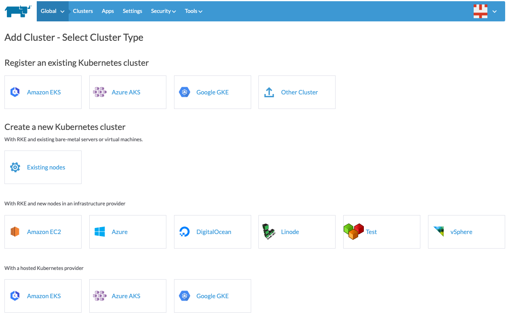

# Example Rancher Cluster Icon

From Cluster Manager > Tools > Drivers -> Node Driver:

Click `Add Node Driver`

In the dialog, use:

<ul>
  <li><a href="https://nwmac.github.io/cluster-driver/docker-machine-driver-test">https://nwmac.github.io/cluster-driver/docker-machine-driver-test</a> as the Download URL</li>
  <li><a href="https://nwmac.github.io/cluster-driver/component.js">https://nwmac.github.io/cluster-driver/component.js</a> as the Custom UI URL</li>
  <li>Add the Whitelist domain `nwmac.github.io`</li>
  <li>Click create</li>
</ul>

Example:

Once added, in Cluster Manager, go to Global > Add Cluster and you should see a provider 'Test' with an icon, e.g. :

